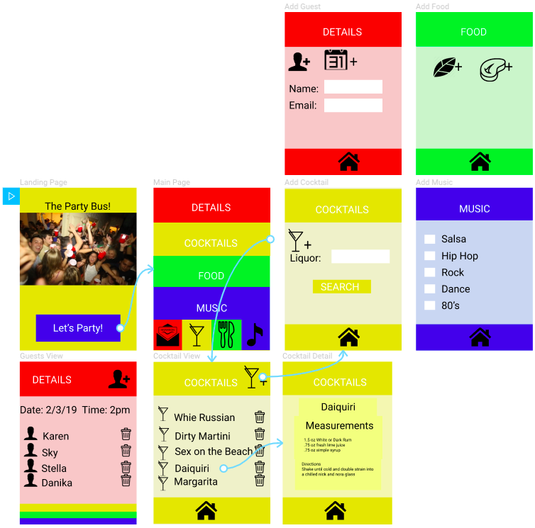
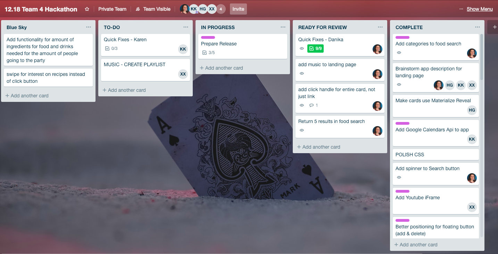

# Party Party

Party Party is an app that helps you plan the perfect house party! Just click through the different sections and the app will guide you as you set your party details and select the drinks, appetizers and music needed to have fun!

### Getting Started

In order to enjoy the full functionality of this app, the following information must be added to a config.js file:
  - A Spoonacular api key set to an API_KEY variable
  - An Add Event api key set to a CALENDAR_API_CLIENT_ID variable

### Team 4
  - Hannel(Sky) Gwak
  - Danika Quinteros
  - Karen King
  - Xiaoyun(Stella) Hsin

### APIs Used
  - [Add Event](https://www.addevent.com/api/direct-url-method) 
  - [The Cocktail Database](https://www.thecocktaildb.com/)
  - [Spoonacular](https://spoonacular.com/food-api)
  - [LearningFuze Youtube](http://s-apis.learningfuze.com/hackathon/youtube/search.php)

### Wireframe
  - [Figma](https://www.figma.com/file/MInndS0JTFEUyADuvK85SpOx/12.18-Team-4-Hackathon?node-id=0%3A1) 
    

### Task Management
  - [Trello](https://trello.com/b/7kqBSbEM/1218-team-4-hackathon) -> private link 
    
